<div align="center">



</div>

# JS-CONTROLER

Firmware tay cầm điều khiển ESP32: dual joystick, TFT ILI9341 + OLED, RF TX (ESP-NOW / NRF24), nhận telemetry, âm thanh cảnh báo (I2S PCM5100A).

| Env | Vai trò |
|---|---|
| `esp32_controller` | Firmware tay cầm chính |
| `esp32_audio_test` | Test riêng module audio |
| `esp32-s3-weact` | Test board ESP32-S3 N16R8 |

```bash
pio run -e esp32_controller
```

`src/RF_Protocol.h` dùng chung với repo **QUAD-UAV** — sửa một bên phải đồng bộ bên kia.
Tổng quan hệ thống: [docs/SYSTEM_OVERVIEW.md](docs/SYSTEM_OVERVIEW.md).
